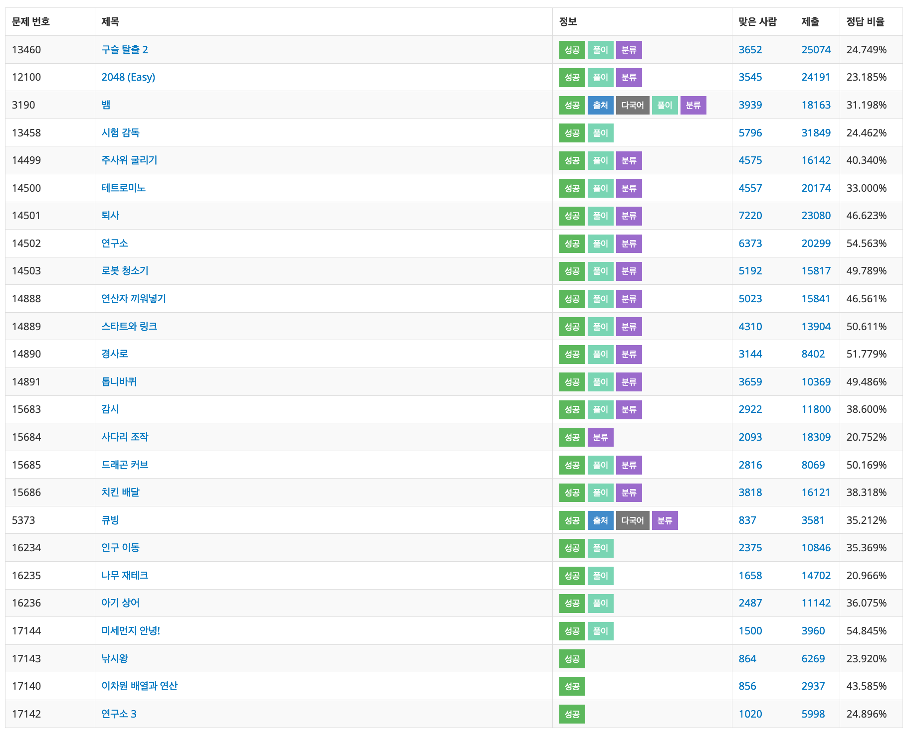

# 삼성 SW 역량 테스트 기출 문제 풀이

[삼성 SW 역량 테스트 기출 문제](https://www.acmicpc.net/workbook/view/1152)

> - 작성자: [solarmagic](https://www.acmicpc.net/user/solarmagic)
> - 코드 작성 언어: C++ (GCC 기준, C++11 이상)

---

## 이용 방법

solutions 폴더에는 풀이 설명이 codes 폴더에는 정답 코드가 올라올 예정입니다.
현재 정답 코드만 올려져 있습니다. 공부와 참조용으로 써주시길 바랍니다.

## 풀이

> 현재는 코드만 AC 맞은 소스만 올려 놓은 상태입니다.
> 가독성을 고려하지 않고 짠 코드가 많고 특히 과거에 짠 소스코드들은 코딩 스타일도 달라 리팩토링을 할 예정입니다.

- [13460](https://www.acmicpc.net/problem/13460) 구슬탈출 2
- [12100](https://www.acmicpc.net/problem/12100) 2048(Easy)
- [3190](https://www.acmicpc.net/problem/3190) 뱀
- [13458](https://www.acmicpc.net/problem/13458) 시험감독
- [14499](https://www.acmicpc.net/problem/1499) 주사위 굴리기
- [14500](https://www.acmicpc.net/problem/14500) 테트로미노
- [14501](https://www.acmicpc.net/problem/14501) 퇴사
- [14502](https://www.acmicpc.net/problem/14502) 연구소
- [14503](https://www.acmicpc.net/problem/14503) 로봇 청소기
- [14888](https://www.acmicpc.net/problem/14888) 연산자 끼워넣기
- [14889](https://www.acmicpc.net/problem/14889) 스타트와 링크
- [14890](https://www.acmicpc.net/problem/14890) 경사로
- [14891](https://www.acmicpc.net/problem/14891) 톱니바퀴
- [15683](https://www.acmicpc.net/problem/15683) 감시
- [15684](https://www.acmicpc.net/problem/15684) 사다리 조작
- [15685](https://www.acmicpc.net/problem/15685) 드래곤 커브
- [15686](https://www.acmicpc.net/problem/15686) 치킨 배달
- [5373](https://www.acmicpc.net/problem/5373)큐빙
- [16234](https://www.acmicpc.net/problem/16234) 인구이동
- [16235](https://www.acmicpc.net/problem/16235) 나무 재테크
- [16236](https://www.acmicpc.net/problem/16236) 아기 상어
- [17144](https://www.acmicpc.net/problem/17144) 미세먼지 안녕!
- [17143](https://www.acmicpc.net/problem/17143) 낚시왕
- [17140](https://www.acmicpc.net/problem/17140) 이차원 배열과 연산
- [17142](https://www.acmicpc.net/problem/17142) 연구소 3

---

 * 표준입출력함수 (cout , printf 에서) 속도 차이  -  검색키워드 : c++ cout printf 속도차이
   - https://cupjoo.tistory.com/97
   - https://eine.tistory.com/entry/CC-%EC%9E%85%EC%B6%9C%EB%A0%A5-%EB%B0%A9%EB%B2%95%EC%97%90-%EB%94%B0%EB%A5%B8-%EC%86%8D%EB%8F%84-%EC%A0%95%EB%A6%AC
   - http://blog.naver.com/PostView.nhn?blogId=skyvvv624&logNo=221138226065
   - https://sexycoder.tistory.com/18
